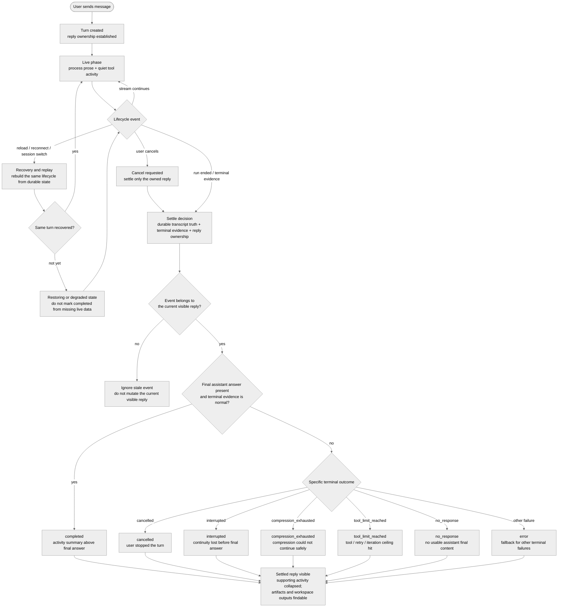

# Live-to-Final Assistant Replies for Long-Running Agent Sessions

- **Status:** Accepted (parent contract; implementation tracked in [#3400](https://github.com/nesquena/hermes-webui/issues/3400))
- **Author:** @franksong2702
- **Created:** 2026-06-03
- **Tracking issue:** [#3400](https://github.com/nesquena/hermes-webui/issues/3400)

## Background: Long-Running Sessions Are The Anchor

This RFC defines the product model for assistant replies in long-running agent
sessions.

Short conversations are still useful sanity checks, but they do not exercise
the hardest browser-agent states. A long-running session can:

- keep the user waiting for minutes,
- make many tool calls,
- produce a long final answer,
- create or update workspace artifacts,
- cross Auto Compression boundaries,
- hit tool-call, retry, or iteration limits,
- lose browser, network, or SSE continuity,
- receive a user cancel or interruption request while startup is still racing,
- switch sessions or reload before the turn settles.

The design should therefore be judged against the long-running case first. A
short conversation should be the same lifecycle with fewer events, not a
separate UI model.

The goal is not to add a Worklog widget, and it is not to make Auto Compression
or duplicate stream ownership the headline. Those are supporting slices and
edge cases. The headline is one coherent assistant reply lifecycle: live work,
supporting activity, terminal outcome, and final answer.

## Product Problem

Hermes WebUI currently uses one chat surface to represent several different
meanings:

- the assistant's live process text while work is still running,
- tool activity and lifecycle status that support that work,
- recovery or replay state after refresh, reconnect, or session switching,
- terminal outcomes such as cancel, interruption, no response, or tool limit,
- the final answer after the turn settles.

Those meanings have repeatedly competed for the same visual space. Some
long-running sessions feel noisy, some look silent while the agent is working,
some recover into a different shape after reconnect, and some terminal edge
cases can appear completed even when no final answer was produced.

This RFC defines the product semantics that implementation PRs and follow-up
RFCs should preserve.

## Scope

### This RFC owns

- The visible lifecycle of one assistant reply from live work to final or
  terminal outcome.
- The boundary between process prose, tool activity, lifecycle status, and the
  final answer.
- Long-running edge-case semantics for Auto Compression, no-final answers,
  tool/iteration limits, cancel/interruption, replay/reconnect/session switch,
  produced artifacts/output handoff, and sidebar/session ownership.
- The classification of work into implemented slices, active PRs, confirmed
  follow-ups, and child RFCs.

### This RFC does not own

- Pixel-level styling.
- Provider/model selection.
- A backend tool-event schema change such as a shared display-title field.
- A new runtime adapter, runner process, storage format, or SSE protocol.
- Rich artifact rendering, executable HTML, visualization plugins, or Canvas
  editing surfaces. This RFC only owns how produced artifacts remain findable
  from the reply lifecycle.
- The full command semantics for Queue, Steer, Stop-and-send, and Interrupt.
  Those belong to the pending-intent control-surface contract tracked by
  [#3058](https://github.com/nesquena/hermes-webui/issues/3058) and
  [#3061](https://github.com/nesquena/hermes-webui/pull/3061).

## Public Inventory

This inventory groups representative public issues and PRs by the
long-running-session concern they expose. It is not a claim that every linked
item is solved by this RFC. The classification column records durable scope,
not current open/merged/superseded state: for live status, the tracking issue
[#3400](https://github.com/nesquena/hermes-webui/issues/3400) is authoritative.

| Concern | Representative signals | Current classification |
| --- | --- | --- |
| Live work vs final answer boundary | [#536](https://github.com/nesquena/hermes-webui/issues/536), [#3400](https://github.com/nesquena/hermes-webui/issues/3400), [#3464](https://github.com/nesquena/hermes-webui/pull/3464) | Main product scope. #3464 landed the first RFC; this document is the parent contract for follow-up slices. |
| First live-to-final reply implementation | [#3401](https://github.com/nesquena/hermes-webui/pull/3401), [#3014](https://github.com/nesquena/hermes-webui/issues/3014), [#3015](https://github.com/nesquena/hermes-webui/pull/3015) | First implementation slice. It should keep using `Refs #3400`; it does not close the umbrella. |
| Auto Compression visibility and context pressure | [#469](https://github.com/nesquena/hermes-webui/issues/469), [#2973](https://github.com/nesquena/hermes-webui/issues/2973), [#3079](https://github.com/nesquena/hermes-webui/issues/3079), [#3315](https://github.com/nesquena/hermes-webui/issues/3315), [#3316](https://github.com/nesquena/hermes-webui/pull/3316) | Supporting edge case. Running compression is live lifecycle status; compression-exhausted/no-final finalization is a terminal-state follow-up. |
| Replay, reconnect, session switch, and reattach | [#2283](https://github.com/nesquena/hermes-webui/pull/2283), [#2924](https://github.com/nesquena/hermes-webui/issues/2924), [#3391](https://github.com/nesquena/hermes-webui/pull/3391) | Supporting recovery infrastructure. The product requirement is same lifecycle after replay, or an explicit degraded/restoring state. |
| Tool, activity, thinking, and visible progress | [#1298](https://github.com/nesquena/hermes-webui/issues/1298), [#3014](https://github.com/nesquena/hermes-webui/issues/3014), [#3015](https://github.com/nesquena/hermes-webui/pull/3015) | Main reply-rendering concern. Process prose stays primary; tool/reasoning/debug detail stays supporting. |
| No-final and terminal failure outcomes | [#3315](https://github.com/nesquena/hermes-webui/issues/3315), [#3316](https://github.com/nesquena/hermes-webui/pull/3316) | Confirmed follow-up / active PR scope. A tool-tail or compression-exhausted run must not settle as normal completion without a real final answer. |
| Cancellation and stream ownership | [#3344](https://github.com/nesquena/hermes-webui/issues/3344), [#3345](https://github.com/nesquena/hermes-webui/pull/3345), [#3475](https://github.com/nesquena/hermes-webui/issues/3475), [#3476](https://github.com/nesquena/hermes-webui/pull/3476) | Supporting cancel/recovery scope. Early-cancel worker reconciliation is addressed by [#3476](https://github.com/nesquena/hermes-webui/pull/3476); frontend cancel owner-guard hardening is the remaining follow-up. |
| Produced artifacts and output handoff | [#2655](https://github.com/nesquena/hermes-webui/issues/2655), [#2673](https://github.com/nesquena/hermes-webui/pull/2673), [#2881](https://github.com/nesquena/hermes-webui/issues/2881), [#2938](https://github.com/nesquena/hermes-webui/pull/2938), [#3329](https://github.com/nesquena/hermes-webui/pull/3329), [#3348](https://github.com/nesquena/hermes-webui/pull/3348), [#3528](https://github.com/nesquena/hermes-webui/issues/3528) | Supporting session-output concern. Existing Artifacts and `workspace://` surfaces make produced files findable; long-running replay/cancel/terminal paths must not lose the tool metadata needed to recover that handoff. |
| Sidebar/session ownership and active-session awareness | [#856](https://github.com/nesquena/hermes-webui/issues/856), [#1370](https://github.com/nesquena/hermes-webui/pull/1370), [#1436](https://github.com/nesquena/hermes-webui/issues/1436) | Confirmed follow-up scope when sidebar/session metadata contradicts the visible active turn. |
| User intervention during live work | [#720](https://github.com/nesquena/hermes-webui/issues/720), [#965](https://github.com/nesquena/hermes-webui/pull/965), [#1062](https://github.com/nesquena/hermes-webui/pull/1062), [#3058](https://github.com/nesquena/hermes-webui/issues/3058), [#3061](https://github.com/nesquena/hermes-webui/pull/3061) | Child RFC scope. This parent RFC only requires that controls preserve ownership, replay, and terminal honesty. |

## Product Model

### Lifecycle flow

The lifecycle below is a product-state model, not a backend schema or
wire-event contract. At settle time, the visible reply state should be derived
from durable transcript truth, available terminal evidence, and reply
ownership. A turn should not be marked `completed` only because live activity
or partial assistant prose existed earlier.

### Reply ownership

One visible assistant reply belongs to one user turn and one active run/stream
identity while that run is active.

Requirements:

- A live event should attach to the assistant reply that owns the run.
- A later turn in the same session must not inherit stale live events from an
  older stream.
- A background session can continue running, but its live stream should not
  mutate the visible pane for another session.
- A terminal event should settle the same turn it belongs to, or route through
  a background/error path if the user is no longer viewing that session.
- Sidebar state should not contradict the visible owner. If the sidebar says a
  session is running, opening it should show live work, a restoring/degraded
  state, or an honest terminal state.

### Live phase

While a turn is running, the assistant reply should read as a live process
narrative.

Requirements:

- Process text is the primary timeline.
- Tool activity is visible but visually quieter than process text.
- Tool rows and tool groups are collapsed by default.
- Full commands, arguments, raw output, and large payloads stay behind deeper
  disclosure.
- Thinking/reasoning that is not user-facing progress should not be the only
  visible signal that work is happening.
- The run timer/status belongs with the active live turn, not as a top
  transcript artifact.
- Running-only lifecycle markers are transient.
- Internal recovery/control messages do not become visible chat content.

### Settled phase

When the turn settles, implementation detail should collapse without swallowing
the final answer.

Requirements:

- A compact activity summary appears above the final answer.
- The activity summary is collapsed by default.
- Expanding it reveals readable process history and tool history.
- Raw command/output detail remains behind deeper disclosure.
- The final answer remains ordinary assistant prose below the summary.
- Running-only markers disappear from the settled transcript unless they
  explain a visible error or recovery outcome.
- Very long final answers remain complete and readable. They should not be
  hidden inside the activity summary or replaced by a progress/status artifact.

### Recovery and replay

Refresh, reconnect, session switching, and replay should preserve the same
reply model.

Requirements:

- Recovered sessions rebuild the same live/final structure used during live
  rendering.
- A reattached session must not silently switch to a different visual model.
- If the exact live scene cannot be reconstructed immediately, the UI should
  show an explicit restoring or degraded state instead of an empty running
  shell.
- Replay must be idempotent. It should not duplicate tokens, progress prose,
  reasoning, tool rows, compression rows, or terminal cards.
- Old in-progress browser state must not override durable session truth.
- Recovery/control events stay internal unless they describe a user-visible
  terminal outcome.

### Terminal outcomes

Every turn needs a terminal outcome. A turn without a final answer must not
look like a normal completed answer.

Required product states:

| State | Meaning |
| --- | --- |
| `completed` | The assistant produced a final answer and the turn settled normally. |
| `cancelled` | The user stopped the turn. |
| `interrupted` | Browser, stream, worker, runtime, or network continuity was lost before a final answer was produced. |
| `compression_exhausted` | Context compression could not create enough room to continue safely. |
| `tool_limit_reached` | The run hit a tool-call, retry, or iteration ceiling before a final answer was produced. |
| `no_response` | The provider or runtime returned no usable assistant final content. |
| `error` | Fallback for failures that do not fit the above states. |

These identifiers name product states, not a wire/enum or persisted schema
contract; consistent with Scope, this RFC does not mandate a backend field or
event shape for them. Copy can evolve, but these semantic distinctions should
stay stable in live rendering, settled rendering, and replay.

When more than one terminal condition applies, the more specific condition
should win over the generic fallback. For example, `cancelled`,
`compression_exhausted`, `tool_limit_reached`, and `no_response` should not be
flattened into a plain `error` only because the turn also failed to produce a
final answer.

## Long-Running Edge Cases

### Auto Compression

Auto Compression is a context lifecycle transition, not a tool call and not
final answer content.

Expected behavior:

- During live work, show compression as quiet transient status.
- When the run continues after compression, converge to a completed compression
  status such as `Context auto-compressed`.
- If one turn crosses the compression barrier more than once, each pass should
  remain understandable without turning compression into the main transcript.
- Do not keep compression status text in the settled transcript unless it
  explains an error or recovery state.
- If compression fails to create enough room, surface `compression_exhausted`
  or another specific terminal outcome instead of normal completion.
- Compression success in the UI does not by itself prove model-facing context
  was pruned; that remains a runtime/context invariant covered by the run-state
  consistency contract.

Confirmed follow-up scope:

- Add or standardize an explicit per-pass compression completion event if the
  UI otherwise has to infer completion from later stream events.
- Keep compression-exhausted/no-final handling aligned with
  [#3315](https://github.com/nesquena/hermes-webui/issues/3315) and
  [#3316](https://github.com/nesquena/hermes-webui/pull/3316).

### Tool-call, retry, and iteration ceilings

Long-running sessions can exhaust tool-call limits, retry budgets, or
iteration ceilings before a final answer is available.

Expected behavior:

- Treat these as explicit terminal outcomes, not as normal completion.
- Preserve the readable work history that led to the limit.
- Keep the final area honest: show that the run stopped because a limit was
  reached rather than inventing a final answer.
- Internal continuation or control prompts used by the runtime must not persist
  as ordinary user-authored transcript content.
- The product state should not depend on whether the limit came from provider
  policy, Hermes Agent iteration budget, or WebUI adapter/runtime policy.

### No-final answer and provider failure

Tool-heavy turns can end with tool output, provider failure, or no usable final
assistant message.

Expected behavior:

- Detect the absence of a final assistant answer at settle time.
- Surface a terminal state such as `no_response`, `interrupted`,
  `compression_exhausted`, `tool_limit_reached`, or `error`.
- Do not mark the turn completed only because some assistant/tool activity
  occurred earlier.
- Do not treat internal context-compaction reference material as a final
  assistant answer.

### Cancel and interruption

Cancel is a user-visible terminal action, not just browser cleanup.

Expected behavior:

- If the user cancels before the run fully starts, the backend still reconciles
  against the live worker state where possible.
- If the user cancels after live text, reasoning, or tools have appeared,
  already-visible work should not be silently lost.
- The frontend cancel path should close the SSE source it owns and only clear
  busy state for the stream it actually cancelled.
- A cancelled turn should settle as `cancelled`, not as provider `no_response`.
- A network or worker interruption should settle as `interrupted` or restoring,
  not as normal completion.

Classification:

- The early startup cancel race tracked by
  [#3475](https://github.com/nesquena/hermes-webui/issues/3475) is addressed by
  [#3476](https://github.com/nesquena/hermes-webui/pull/3476).
- The owner-aware browser cancel cleanup tracked by
  [#3344](https://github.com/nesquena/hermes-webui/issues/3344) and
  [#3345](https://github.com/nesquena/hermes-webui/pull/3345) remains a
  focused follow-up.

### Reconnect and session switch

Long-running work often outlives one browser attachment.

Expected behavior:

- Switching away and back should replay already-streamed process/tool history.
- Refresh and reconnect should preserve the active turn's identity.
- Slow rebuild should be visibly restoring or degraded, not blank.
- Sidebar/session metadata should not point the user at a stale or wrong active
  session.
- Replay should use the same visible lifecycle as live rendering rather than a
  flattened alternate presentation.

Confirmed follow-up scope:

- A clearer restoring/degraded state during slow reattach.
- Native `Last-Event-ID` or equivalent reconnect cursor support when it is
  ready to replace or complement the current replay cursor path.
- Additional tests that prove live and replay use the same lifecycle for
  process prose, tool rows, compression status, and terminal states.

### Tool-only or low-prose runs

Some valid long-running turns may produce little or no visible process prose
before the final answer, especially when the model runs a dense sequence of
tools.

Expected behavior:

- The UI should not fabricate assistant prose.
- Tool activity should remain readable enough that the turn does not look
  empty or broken.
- Empty placeholders should be filtered rather than rendered as blank prose.
- If no final answer arrives, the terminal state should explain that outcome
  instead of leaving only a tool list.

### Very long final answers

Long-running sessions can end with a final answer that is itself lengthy.

Expected behavior:

- The final answer remains the primary settled assistant content.
- Supporting activity stays above it and collapsed by default.
- Streaming and settle transitions should not jump the user away from the final
  answer or make the answer look like tool output.
- Any additional collapse, preview, outline, or navigation affordance for very
  long final answers must preserve the full answer as ordinary assistant prose.

### Produced artifacts and output handoff

Long-running sessions often create or update files in the workspace, such as
plans, reports, patches, data files, generated markdown, or other artifacts.
Those artifacts are part of what the user needs from the completed work, even
when they are not the final answer text itself.

Expected behavior:

- Existing artifact surfaces, such as the session Artifacts tab and
  `workspace://` links, remain supporting navigation surfaces rather than
  replacing the final answer.
- If a turn creates or edits workspace artifacts, the settled reply should not
  hide the fact that those artifacts exist or make them impossible to find.
- Reconnect, replay, session switching, cancel, interruption, and no-final
  terminal paths should preserve enough tool/artifact metadata to rebuild the
  same artifact handoff.
- A terminal failure should still distinguish between "no final answer" and
  "some artifacts were produced before the run stopped".
- Large generated files or rich artifact types should route through the
  workspace/artifact preview model instead of being expanded into the main chat
  transcript by default.

Confirmed follow-up scope:

- Keep artifact recoverability aligned with the session-scoped Artifacts tab
  work in [#2655](https://github.com/nesquena/hermes-webui/issues/2655) and
  [#2673](https://github.com/nesquena/hermes-webui/pull/2673).
- Keep final-answer artifact links aligned with the `workspace://` preview
  path from [#2881](https://github.com/nesquena/hermes-webui/issues/2881) and
  [#2938](https://github.com/nesquena/hermes-webui/pull/2938).
- Treat interrupted/cancelled tool-history loss, such as
  [#3528](https://github.com/nesquena/hermes-webui/issues/3528), as a
  live-to-final recoverability bug when it prevents artifact reconstruction.

### Sidebar and session ownership

Long-running sessions are not only a chat-pane concern. The sidebar and session
metadata help users find active work and later terminal outcomes.

Expected behavior:

- A session row's running indicator should reflect a real active run or a
  clearly restorable state, not stale persisted metadata alone.
- Background completion, cancellation, or failure should be represented without
  stealing the visible pane from the user.
- Session switching should not erase pending live context, in-flight snapshots,
  tool history, or terminal outcome state.
- Maintenance writes, stale cleanup, and background repair should not make old
  sessions look newly active unless meaningful user/assistant activity happened.

### User intervention

During long-running work, the user may queue follow-up input, steer the current
direction, or stop the run and send a replacement.

Expected behavior:

- These controls should not corrupt the live-to-final reply lifecycle.
- Queue/Steer/Stop-and-send/Interrupt command semantics should be defined in a
  separate control-surface contract.
- This RFC only requires that live-session controls preserve clear ownership,
  terminal outcomes, and replayable state.

The current child contract is tracked by
[#3058](https://github.com/nesquena/hermes-webui/issues/3058) and
[#3061](https://github.com/nesquena/hermes-webui/pull/3061). That child RFC
should own questions such as:

- whether Queue is browser-backed or server-backed in each slice,
- when Queue can upgrade to Steer,
- what Stop-and-send means,
- how delivered vs applied Steer is represented,
- what happens to leftover Steer after the run ends.

## Delivery And Follow-Up Map

Use this map to keep implementation PRs and child RFCs scoped. The "vehicle"
column names a durable track, not live merge state; the tracking issue
[#3400](https://github.com/nesquena/hermes-webui/issues/3400) is authoritative
for current open/merged/superseded status.

| Track | Scope | Current vehicle |
| --- | --- | --- |
| Parent product RFC | Define the long-running live-to-final assistant reply lifecycle and review checklist. | This RFC; tracking issue [#3400](https://github.com/nesquena/hermes-webui/issues/3400). |
| First reply lifecycle implementation | Live process prose, quiet tool activity, settled activity summary above final answer, replay/reattach consistency, live-only compression status, supporting stream ownership fixes. | [#3401](https://github.com/nesquena/hermes-webui/pull/3401). |
| Terminal/no-final stabilization | Compression exhausted, tool-tail/no-final transcript shape, context-compaction marker suppression, terminal error routing. | [#3315](https://github.com/nesquena/hermes-webui/issues/3315), [#3316](https://github.com/nesquena/hermes-webui/pull/3316). |
| Cancel ownership hardening | Frontend cancel should close its own SSE source and clear only its own busy state. | [#3344](https://github.com/nesquena/hermes-webui/issues/3344), [#3345](https://github.com/nesquena/hermes-webui/pull/3345). |
| Early-cancel startup race | Backend cancel should still interrupt the worker when the SSE registry detached before startup fully settled. | [#3475](https://github.com/nesquena/hermes-webui/issues/3475), [#3476](https://github.com/nesquena/hermes-webui/pull/3476). |
| Pending-intent control surface | Queue, Steer, Stop-and-send, Interrupt, delivered/applied/leftover semantics. | [#3058](https://github.com/nesquena/hermes-webui/issues/3058), [#3061](https://github.com/nesquena/hermes-webui/pull/3061). |
| Reattach and replay polish | Slow rebuild degraded state, replay/body timing, native cursor support, same lifecycle through replay. | Follow-up issue/PR or child RFC if protocol semantics expand. |
| Tool-limit and max-iteration terminal state | Limit reached state, control prompt visibility, no fake final answer. | Follow-up issue/PR; may involve Hermes Agent if the runtime owns the limit signal. |
| Artifact handoff and recoverability | Preserve the link between final/terminal replies and workspace artifacts created or edited during the turn. | Existing Artifacts and `workspace://` surfaces; follow-up issue/PR when replay, cancel, or terminal paths lose artifact metadata. |
| Sidebar/session ownership | Active/terminal state in session rows, stale spinner repair, session-list disappearance, background terminal feedback. | Follow-up issue/PR under session/runtime contracts. |
| Very long final answer ergonomics | Optional navigation/outline/preview affordances that preserve the final answer as normal prose. | Open product discussion; no implementation vehicle yet. |

## Relationship To Existing Contracts

This RFC sits above the current runtime, recovery, and adapter contracts:

- [`webui-run-state-consistency-contract.md`](webui-run-state-consistency-contract.md)
  defines how transcript, context, stream, replay, compression, and session
  metadata stay coherent.
- [`canonical-session-resolution.md`](canonical-session-resolution.md) defines
  how URL, local browser state, sidebar rows, and compression lineage resolve
  to one visible session target.
- [`turn-journal.md`](turn-journal.md) defines crash-safe submitted-turn and
  interrupted-turn recovery semantics.
- [`hermes-run-adapter-contract.md`](hermes-run-adapter-contract.md) defines
  longer-term event/control ownership and migration gates.

This RFC defines the product meaning those lower-level contracts need to
preserve for long-running assistant replies.

The pending-intent control-surface RFC tracked by
[#3058](https://github.com/nesquena/hermes-webui/issues/3058) and
[#3061](https://github.com/nesquena/hermes-webui/pull/3061) should be treated
as a child contract: it can define user intervention semantics without
redefining the live-to-final reply lifecycle.

## Review Checklist

Use this checklist when reviewing PRs against this RFC:

- Does the change preserve long-running session readability?
- Does live process text stay primary over tool metadata?
- Are tool details available without becoming the main transcript?
- Does the final answer remain separate from supporting activity?
- Are compression, no-final, tool-limit, cancel, and interrupt outcomes
  classified honestly?
- Does reconnect/session switch rebuild the same reply lifecycle or degrade
  explicitly?
- If the turn produced workspace artifacts, can the user still find them after
  settle, replay, reconnect, cancel, or terminal failure?
- Do internal recovery or control messages stay out of ordinary chat content?
- Does sidebar/session state agree with the visible active or terminal turn?
- Is the PR's slice clear: lifecycle, terminal/recovery, cancel ownership,
  live controls, sidebar/session ownership, or protocol integration?
- If the change belongs to Queue/Steer/Stop-and-send/Interrupt, is it routed to
  the child control-surface RFC instead of being hidden inside this parent RFC?

## Open Questions

Open questions are limited to product choices that are not already decided by
this RFC, an active implementation PR, or a child RFC.

- Should very long final answers gain additional navigation, outline, or
  preview affordances beyond standard chat transcript behavior? If yes, what
  threshold triggers them and how do they preserve the answer as ordinary
  assistant prose?
- When a turn produces multiple workspace artifacts, should the final answer
  include an automatic artifact summary or navigation affordance, or should the
  product rely on the existing Artifacts tab and explicit `workspace://` links?
- What is the minimum sidebar signal for background long-running sessions that
  have completed, failed, cancelled, or need attention while the user was
  viewing another session?
- Which terminal outcomes should offer inline recovery actions, such as retry,
  continue, inspect details, or reopen from checkpoint, and which should remain
  informational only?
